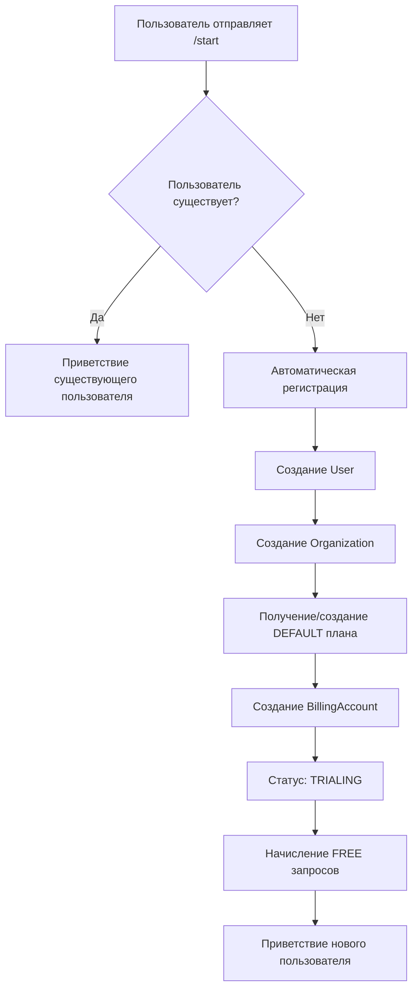
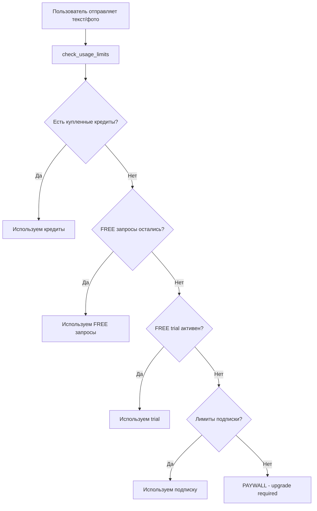
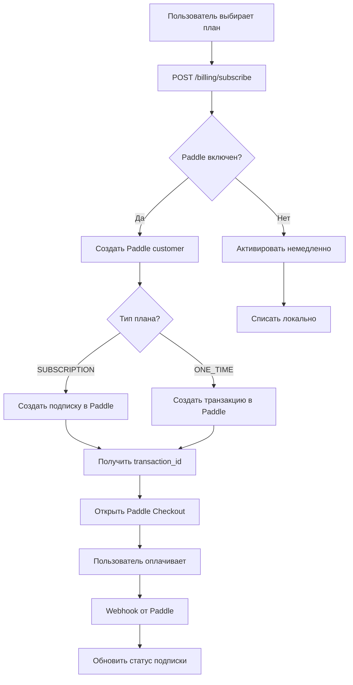

# Алгоритм работы Telegram Bot - Детальное описание

## 📋 Оглавление

1. [Регистрация и первичный вход](#1-регистрация-и-первичный-вход)
2. [Сценарий: FREE кредиты закончились](#2-сценарий-free-кредиты-закончились)
3. [Сценарий: Купленные кредиты закончились](#3-сценарий-купленные-кредиты-закончились)
4. [Апгрейд плана подписки](#4-апгрейд-плана-подписки)
5. [Отмена подписки](#5-отмена-подписки)
6. [Приоритеты использования кредитов](#6-приоритеты-использования-кредитов)
7. [Комбинированная модель](#7-комбинированная-модель)

---

## 1. Регистрация и первичный вход

### 1.1 Команда `/start`

**Файл:** [`app/channels/telegram.py`](app/channels/telegram.py#L185-L233)

**Алгоритм:**



**Детали реализации:**

1. **Проверка существования пользователя**
   ```python
   result = await db.execute(
       select(User).where(User.telegram_id == user_id)
   )
   user = result.scalar_one_or_none()
   ```

2. **Если пользователь НЕ найден → Автоматическая регистрация:**

   a) Создание пользователя:
   ```python
   new_user = User(
       email=f"tg_{user_id}@telegram.local",  # Временный email
       username=username or f"tg_{user_id}",
       telegram_id=user_id,
       telegram_username=username,
       full_name=update.effective_user.full_name,
       is_active=True,
       is_verified=False,
   )
   ```

   b) Создание организации (через auth/router.py):
   ```python
   org = Organization(
       name=f"{user.username}'s Workspace",
       owner_id=user.id
   )
   ```

   c) Поиск/создание DEFAULT плана:
   ```python
   # Ищем план с is_default=True
   default_plan = await db.execute(
       select(SubscriptionPlan).where(SubscriptionPlan.is_default == True)
   )
   
   # Если нет - создаем новый
   if not default_plan:
       default_plan = SubscriptionPlan(
           name="Free Trial",
           interval=SubscriptionInterval.MONTHLY,
           plan_type=PlanType.SUBSCRIPTION,
           price=Decimal("0.00"),
           max_requests_per_interval=0,  # После FREE - блокировка
           free_requests_limit=10,       # 10 БЕСПЛАТНЫХ запросов
           is_default=True
       )
   ```

   d) Создание billing account:
   ```python
   billing_account = BillingAccount(
       organization_id=org.id,
       subscription_plan_id=default_plan.id,
       subscription_status=SubscriptionStatus.TRIALING,  # Пробный период
       free_requests_used=0,
       requests_used_current_period=0,
       one_time_requests_used=0,
       trial_started_at=datetime.utcnow(),
       period_started_at=datetime.utcnow()
   )
   ```

3. **Результат:**
   - Пользователь получает 10 бесплатных запросов
   - Статус: `TRIALING` (пробный период)
   - Может сразу использовать бота

---

## 2. Сценарий: FREE кредиты закончились

### 2.1 Проверка лимитов при запросе

**Файл:** [`app/policy/engine.py`](app/policy/engine.py#L130-L260)

**Алгоритм:**



**Код проверки:**

```python
async def check_usage_limits(db, user, agent_id):
    # 1️⃣ ПРИОРИТЕТ 1: Купленные кредиты (ONE_TIME)
    credits_remaining = total_purchased - credits_used
    if credits_remaining > 0:
        return {
            "allowed": True,
            "reason": f"Credits available: {credits_remaining} remaining",
            "paid_remaining": credits_remaining,
            "should_upgrade": credits_remaining <= 5  # Предупреждение
        }
    
    # 2️⃣ ПРИОРИТЕТ 2: Бесплатные запросы (FREE)
    free_remaining = plan.free_requests_limit - billing_account.free_requests_used
    if free_remaining > 0:
        return {
            "allowed": True,
            "reason": f"Free requests available: {free_remaining} remaining",
            "free_remaining": free_remaining,
            "should_upgrade": False
        }
    
    # 3️⃣ ПРИОРИТЕТ 3: FREE trial (если есть)
    if plan.free_trial_days > 0:
        trial_end = trial_started_at + timedelta(days=plan.free_trial_days)
        if datetime.utcnow() < trial_end:
            return {
                "allowed": True,
                "reason": f"Trial active",
                "should_upgrade": True  # Рекомендуем купить
            }
    
    # 4️⃣ ПРИОРИТЕТ 4: Лимиты подписки
    paid_remaining = plan.max_requests_per_interval - requests_used_current_period
    if paid_remaining > 0:
        return {
            "allowed": True,
            "reason": f"Paid requests available: {paid_remaining} remaining",
            "should_upgrade": False
        }
    
    # ❌ ВСЕ ЛИМИТЫ ИСЧЕРПАНЫ
    return {
        "allowed": False,
        "reason": "Request limit exceeded. Please upgrade.",
        "should_upgrade": True
    }
```

### 2.2 Обработка в Telegram

**При отправке текста:**

```python
async def handle_text_message(update, context):
    # Проверяем лимиты
    usage_info = await policy_engine.check_usage_limits(db, user, agent.id)
    
    if not usage_info["allowed"]:
        # ❌ PAYWALL
        await update.message.reply_text(
            error_text("usage_limit", user.locale),
            parse_mode="Markdown"
        )
        return
    
    # ✅ Обрабатываем запрос
    output, usage_tokens = await agent_runtime.run(agent, variables)
    
    # Инкрементируем счетчик
    await policy_engine.increment_usage(db, user)
    
    # Отправляем ответ
    await update.message.reply_text(output)
```

**При отправке фото:**

```python
async def handle_photo(update, context):
    # Та же логика проверки
    usage_info = await policy_engine.check_usage_limits(db, user, agent.id)
    
    if not usage_info["allowed"]:
        await processing_msg.edit_text(
            error_text("usage_limit", user.locale)
        )
        return
    
    # Обработка фото + AI
    # ...
```

### 2.3 Текст ошибки

**Файл:** [`app/channels/texts.py`](app/channels/texts.py)

```python
def error_text(error_key: str, locale: Optional[str]) -> str:
    if error_key == "usage_limit":
        return (
            "⚠️ Вы исчерпали лимит бесплатных запросов.\n\n"
            "Чтобы продолжить использование:\n"
            "1. Купите пакет кредитов\n"
            "2. Оформите подписку\n"
            "3. Дождитесь начала нового периода\n\n"
            "Перейдите в Dashboard → Upgrade"
        )
```

---

## 3. Сценарий: Купленные кредиты закончились

### 3.1 Система ONE_TIME кредитов

**Модель:** [`app/models/billing.py`](app/models/billing.py)

```python
class BillingAccount:
    # Купленные кредиты (ONE_TIME)
    one_time_purchases_count: int = 0      # Всего куплено
    one_time_requests_used: int = 0        # Уже использовано
    
    # credits_remaining = one_time_purchases_count - one_time_requests_used
```

### 3.2 Алгоритм списания

**Файл:** [`app/policy/engine.py`](app/policy/engine.py#L267-L305)

```python
async def increment_usage(db, user):
    # ПРИОРИТЕТ 1: Списываем из кредитов
    credits_remaining = total_purchased - credits_used
    
    if credits_remaining > 0:
        billing_account.one_time_requests_used += 1
        await db.commit()
        return  # ✅ Списали из кредитов
    
    # Если кредиты закончились и план ONE_TIME
    if plan.plan_type == PlanType.ONE_TIME:
        # ❌ Больше нет доступа
        await db.commit()
        return
    
    # ПРИОРИТЕТ 2: Списываем из подписки
    if free_requests_used < plan.free_requests_limit:
        billing_account.free_requests_used += 1
    else:
        billing_account.requests_used_current_period += 1
    
    await db.commit()
```

### 3.3 Когда кредиты закончились

**check_usage_limits:**

```python
# Если кредитов нет
if credits_remaining == 0:
    # Для ONE_TIME плана
    if plan.plan_type == PlanType.ONE_TIME:
        return {
            "allowed": False,
            "reason": "One-time credits exhausted. Purchase more credits.",
            "should_upgrade": True
        }
    
    # Для SUBSCRIPTION плана - переходим к проверке лимитов подписки
    # (см. ПРИОРИТЕТ 2, 3, 4 выше)
```

### 3.4 Отображение в Dashboard

**Файл:** [`app/templates/upgrade.html`](app/templates/upgrade.html#L45-L70)

```javascript
// Секция для кредитов
if (account.credits_purchased !== null) {
    const remaining = account.credits_remaining || 0;
    const total = account.credits_purchased || 0;
    
    document.getElementById('creditsInfo').textContent = 
        `${remaining} из ${total} осталось`;
    
    // Прогресс-бар
    const creditsProgress = ((total - remaining) / total) * 100;
    document.getElementById('creditsProgress').style.width = creditsProgress + '%';
    
    // ⚠️ Предупреждение
    if (remaining <= 5) {
        showAlert("Кредиты заканчиваются! Рекомендуем купить еще.", "warning");
    }
}
```

---

## 4. Апгрейд плана подписки

### 4.1 Процесс апгрейда

**Файл:** [`app/billing/router.py`](app/billing/router.py#L413-L520)



**Код:**

```python
@router.post("/subscribe")
async def subscribe(payload: SubscribeRequest, current_user, db, paddle):
    plan = await db.execute(
        select(SubscriptionPlan).where(SubscriptionPlan.id == payload.plan_id)
    )
    plan = plan.scalar_one_or_none()
    
    # 1️⃣ Валидация
    if not plan:
        raise HTTPException(404, "Plan not found")
    
    # 2️⃣ Проверка существующей подписки
    if ba.paddle_subscription_id and plan.plan_type == PlanType.SUBSCRIPTION:
        # ❌ Уже есть активная подписка - нельзя создать вторую
        raise HTTPException(400, "Active subscription exists. Cancel first.")
    
    # 3️⃣ Для ONE_TIME планов - РАЗРЕШАЕМ покупку при активной подписке
    # (комбинированная модель)
    
    # 4️⃣ Создание Paddle транзакции
    if settings.paddle_billing_enabled:
        # Создать или получить customer_id
        if not ba.paddle_customer_id:
            customer = await paddle.create_customer(
                email=current_user.email,
                name=current_user.full_name
            )
            ba.paddle_customer_id = customer["id"]
        
        # Создать транзакцию
        if plan.plan_type == PlanType.SUBSCRIPTION:
            transaction = await paddle.create_subscription(
                customer_id=ba.paddle_customer_id,
                price_id=plan.paddle_price_id
            )
        else:  # ONE_TIME
            transaction = await paddle.create_transaction_checkout(
                customer_id=ba.paddle_customer_id,
                price_id=plan.paddle_price_id
            )
        
        transaction_id = transaction["id"]
        checkout_url = transaction["checkout"]["url"]
        
        # 5️⃣ Возврат transaction_id для открытия Paddle Checkout
        return {
            "transaction_id": transaction_id,
            "checkout_url": checkout_url
        }
    else:
        # Локальный режим (без Paddle)
        ba.subscription_plan_id = plan.id
        ba.subscription_status = SubscriptionStatus.ACTIVE
        if plan.plan_type == PlanType.ONE_TIME:
            ba.one_time_purchases_count += plan.one_time_limit
        await db.commit()
```

### 4.2 Обработка Webhook от Paddle

**Файл:** [`app/webhooks/router.py`](app/webhooks/router.py#L148-L210)

**События:**

- `subscription.created` - новая подписка создана
- `subscription.activated` - подписка активирована
- `transaction.completed` - одноразовая покупка завершена

**Код:**

```python
async def handle_subscription_created(data, db):
    paddle_subscription_id = data["id"]
    customer_id = data["customer_id"]
    price_id = data["items"][0]["price"]["id"]
    
    # Найти billing_account по customer_id
    billing_account = await db.execute(
        select(BillingAccount).where(
            BillingAccount.paddle_customer_id == customer_id
        )
    )
    
    # Найти plan по price_id
    plan = await db.execute(
        select(SubscriptionPlan).where(
            SubscriptionPlan.paddle_price_id == price_id
        )
    )
    
    # Обновить billing_account
    billing_account.paddle_subscription_id = paddle_subscription_id
    billing_account.subscription_plan_id = plan.id
    billing_account.subscription_status = SubscriptionStatus.ACTIVE
    billing_account.subscription_start_date = datetime.utcnow()
    billing_account.next_billing_date = data["next_billed_at"]
    
    await db.commit()
```

**Для ONE_TIME покупок:**

```python
async def handle_transaction_completed(data, db):
    transaction_id = data["id"]
    customer_id = data["customer_id"]
    
    # Получить купленные кредиты из items
    items = data.get("items", [])
    for item in items:
        price_id = item["price"]["id"]
        quantity = item.get("quantity", 1)
        
        # Найти план
        plan = await db.execute(
            select(SubscriptionPlan).where(
                SubscriptionPlan.paddle_price_id == price_id
            )
        )
        
        if plan.plan_type == PlanType.ONE_TIME:
            # Начислить кредиты
            credits = plan.one_time_limit * quantity
            billing_account.one_time_purchases_count += credits
            
            # Записать в историю
            purchase = OneTimePurchase(
                billing_account_id=billing_account.id,
                paddle_transaction_id=transaction_id,
                amount=credits,
                purchase_date=datetime.utcnow()
            )
            db.add(purchase)
    
    await db.commit()
```

### 4.3 Frontend (Paddle Checkout)

**Файл:** [`app/templates/upgrade.html`](app/templates/upgrade.html#L378-L410)

```javascript
async function subscribeToPlan(event, planId) {
    // Отправить запрос на создание подписки
    const result = await apiCall('/billing/subscribe', {
        method: 'POST',
        body: JSON.stringify({ plan_id: planId })
    });
    
    if (result.transaction_id) {
        // Открыть Paddle Checkout Overlay
        Paddle.Checkout.open({
            transactionId: result.transaction_id,
            settings: {
                successUrl: window.location.origin + '/billing/success',
                displayMode: 'overlay'
            }
        });
    } else if (result.checkout_url) {
        // Фоллбэк - редирект
        window.location.href = result.checkout_url;
    }
}
```

---

## 5. Отмена подписки

### 5.1 Через Paddle Dashboard

1. Пользователь отменяет подписку в Paddle
2. Paddle отправляет webhook `subscription.cancelled`
3. Система обрабатывает webhook

**Код:**

```python
async def handle_subscription_cancelled(data, db):
    paddle_subscription_id = data["id"]
    cancelled_at = data["cancelled_at"]
    
    billing_account = await db.execute(
        select(BillingAccount).where(
            BillingAccount.paddle_subscription_id == paddle_subscription_id
        )
    )
    
    # Обновить статус
    billing_account.subscription_status = SubscriptionStatus.CANCELED
    billing_account.cancelled_at = datetime.fromisoformat(cancelled_at)
    
    await db.commit()
```

### 5.2 Через API (будущее)

**Файл:** [`app/billing/router.py`](app/billing/router.py#L523-L540)

```python
@router.post("/cancel")
async def cancel_subscription(current_user, db):
    ba = await db.execute(
        select(BillingAccount).where(
            BillingAccount.organization_id == current_user.organization_id
        )
    )
    
    # Отменить в Paddle
    if settings.paddle_billing_enabled and ba.paddle_subscription_id:
        await paddle_client.cancel_subscription(ba.paddle_subscription_id)
    
    # Локальная отмена
    ba.subscription_status = SubscriptionStatus.CANCELED
    ba.subscription_end_date = datetime.utcnow()
    
    await db.commit()
```

### 5.3 Что происходит после отмены

1. **Статус:** `CANCELED`
2. **Купленные кредиты:** НЕ СГОРАЮТ - остаются доступны
3. **Лимиты подписки:** Становятся недоступны после окончания оплаченного периода
4. **FREE запросы:** Сбрасываются (больше не доступны)

**Проверка доступа:**

```python
# В check_usage_limits
if billing_account.subscription_status == SubscriptionStatus.CANCELED:
    # Проверяем только кредиты
    if credits_remaining > 0:
        return {"allowed": True}
    else:
        return {"allowed": False, "should_upgrade": True}
```

---

## 6. Приоритеты использования кредитов

### 6.1 Порядок проверки

```
1️⃣ ONE_TIME кредиты (купленные)
   └─> Если > 0: использовать
   
2️⃣ FREE запросы (бесплатные)
   └─> Если > 0: использовать
   
3️⃣ FREE TRIAL (пробный период)
   └─> Если активен: использовать
   
4️⃣ SUBSCRIPTION лимиты (подписка)
   └─> Если > 0: использовать
   
❌ ВСЕ ИСЧЕРПАНЫ → PAYWALL
```

### 6.2 Порядок списания

```python
async def increment_usage(db, user):
    # 1️⃣ Списать из кредитов
    if credits_remaining > 0:
        billing_account.one_time_requests_used += 1
        return
    
    # 2️⃣ Списать из FREE
    if free_requests_used < plan.free_requests_limit:
        billing_account.free_requests_used += 1
        return
    
    # 3️⃣ Списать из подписки
    billing_account.requests_used_current_period += 1
```

### 6.3 Почему такой порядок?

- **Кредиты первые:** Пользователь заплатил за них → используем в первую очередь
- **FREE второй:** Бесплатные запросы - bonus для новых пользователей
- **Trial третий:** Временный доступ для ознакомления
- **Subscription последний:** Регулярный лимит, сбрасывается каждый период

---

## 7. Комбинированная модель

### 7.1 Что это?

**Пользователь может одновременно иметь:**
- ✅ Активную SUBSCRIPTION подписку (monthly/yearly)
- ✅ Купленные ONE_TIME кредиты

**Пример:**
- План: Premium ($39/месяц) → 1000 запросов/месяц
- Купленные кредиты: 500 запросов (ONE_TIME)
- **ИТОГО:** 1500 запросов доступно

### 7.2 Как работает

**При запросе:**
```python
# 1️⃣ Сначала используем кредиты (500)
if credits_remaining > 0:
    use_credits()
    
# 2️⃣ Когда кредиты закончились → переходим к подписке (1000)
if paid_remaining > 0:
    use_subscription()
```

**Пример использования:**
```
Запрос #1:   credits_remaining=500 → 499 ✅
Запрос #2:   credits_remaining=499 → 498 ✅
...
Запрос #500: credits_remaining=1   → 0   ✅

Запрос #501: credits_remaining=0, paid_remaining=1000 → 999 ✅
Запрос #502: paid_remaining=999 → 998 ✅
```

### 7.3 Преимущества

1. **Гибкость:** Пользователь может докупить кредиты без отмены подписки
2. **Не сгорают:** Кредиты остаются после отмены подписки
3. **Экономия:** Можно купить большой пакет со скидкой

### 7.4 Отображение в UI

**Файл:** [`app/templates/upgrade.html`](app/templates/upgrade.html)

```javascript
// Показываем ОБЕ секции одновременно
if (account.plan_type === 'subscription') {
    document.getElementById('subscriptionDetails').style.display = 'block';
    document.getElementById('periodRequestsInfo').textContent = 
        `${account.period_used} / ${account.period_limit}`;
}

// И ЕСЛИ ЕСТЬ КРЕДИТЫ - тоже показываем
if (account.credits_purchased > 0) {
    document.getElementById('creditsDetails').style.display = 'block';
    document.getElementById('creditsInfo').textContent = 
        `${account.credits_remaining} из ${account.credits_purchased}`;
}
```

---

## 📊 Примеры сценариев

### Сценарий A: Новый пользователь

1. `/start` → Авторегистрация
2. Получает: 10 FREE запросов
3. Использует: 5 запросов
4. Остаток: 5 FREE
5. Видит: "5 free requests remaining"

### Сценарий B: FREE закончились

1. Использовал: 10/10 FREE
2. Пытается отправить запрос
3. Получает: ❌ "Лимит исчерпан. Upgrade required."
4. Переходит: `/billing/upgrade`
5. Выбирает: Plan ($19/month)
6. Оплачивает: Paddle Checkout
7. Получает: 500 requests/month

### Сценарий C: Докупка кредитов

1. Имеет: Premium подписку (1000/month)
2. Использовал: 800/1000
3. Остаток: 200 requests
4. Покупает: Credits Pack (500 кредитов)
5. Теперь имеет: 500 credits + 200 subscription = 700 total

### Сценарий D: Отмена подписки

1. Отменяет: Premium подписку
2. Статус: `CANCELED`
3. Осталось: 250 купленных кредитов
4. Может использовать: 250 запросов (кредиты НЕ сгорают)
5. После исчерпания: Paywall

---

## 🔗 Связанные файлы

| Файл | Описание |
|------|----------|
| [app/channels/telegram.py](app/channels/telegram.py) | Telegram bot handlers |
| [app/policy/engine.py](app/policy/engine.py) | Проверка лимитов и списание |
| [app/billing/router.py](app/billing/router.py) | API подписок и покупок |
| [app/webhooks/router.py](app/webhooks/router.py) | Обработка Paddle webhooks |
| [app/models/billing.py](app/models/billing.py) | Модели данных биллинга |
| [app/templates/upgrade.html](app/templates/upgrade.html) | UI для апгрейда |
| [app/templates/dashboard.html](app/templates/dashboard.html) | Dashboard с отображением лимитов |

---

## 📝 Заметки по развертыванию

### Переменные окружения

```bash
# Paddle
PADDLE_BILLING_ENABLED=true
PADDLE_API_KEY=your_api_key
PADDLE_WEBHOOK_SECRET=your_webhook_secret
PADDLE_ENVIRONMENT=sandbox  # или production
PADDLE_CLIENT_TOKEN=your_client_token

# Telegram
TELEGRAM_BOT_TOKEN=your_bot_token
TELEGRAM_USE_WEBHOOK=true
TELEGRAM_WEBHOOK_PATH=/telegram/webhook
TELEGRAM_BASE_URL=https://your-domain.com
```

### Миграции

```bash
# Добавить Paddle поля
alembic upgrade head
```

### Настройка Webhook в Paddle

1. Dashboard → Notifications → Webhooks
2. URL: `https://your-domain.com/webhooks/paddle`
3. Events: `subscription.*`, `transaction.*`
4. Secret: Скопировать в `PADDLE_WEBHOOK_SECRET`

---

## 🎯 TODO / Будущие улучшения

- [ ] Автоматическое напоминание о скором исчерпании лимитов
- [ ] Email-уведомления о покупках и отменах
- [ ] Реферальная программа (бонусные кредиты)
- [ ] Gift cards (подарочные кредиты)
- [ ] Корпоративные планы (team billing)
- [ ] API для управления подписками из Telegram
- [ ] Статистика использования по дням/неделям
